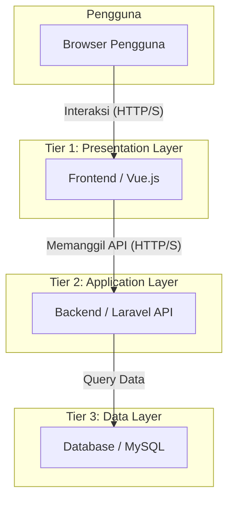
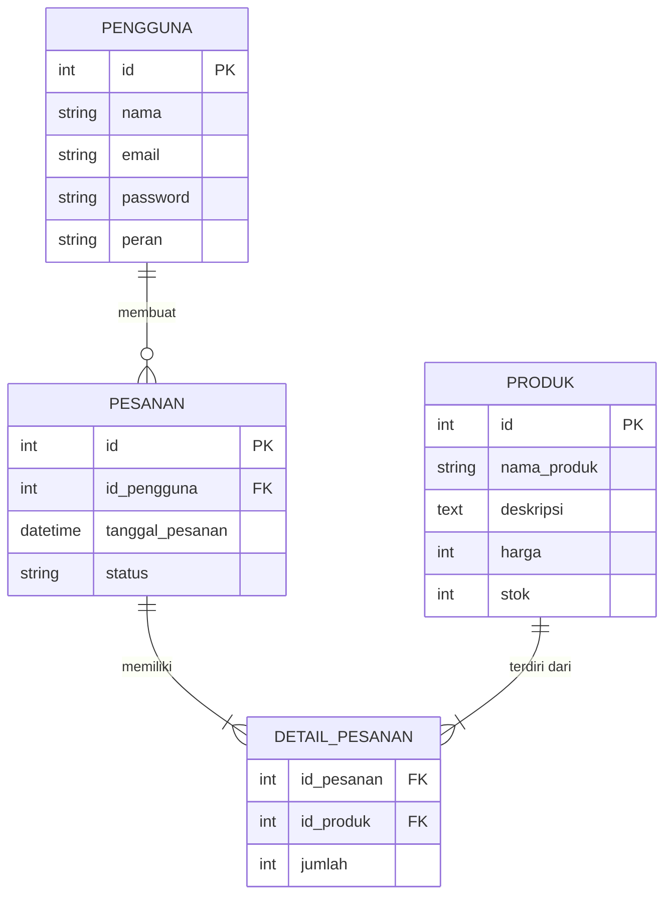

# Arsitektur dan Skema Sistem

Dokumen ini merinci arsitektur teknis, landasan teori, dan skema basis data dari sistem pemasaran pertanian berbasis web yang dikembangkan sebagai artefak utama dalam penelitian ini. Desain ini mengacu pada hasil kerja di **Tahap 1** penelitian dan didasarkan pada `ws-06-system-experiment.md` dan `ws-09-implementation.md`.

---

## 1. Landasan Teori dan Arsitektur

Sistem ini dirancang menggunakan **arsitektur 3-Tier** yang memisahkan antara presentasi (antarmuka pengguna), logika bisnis (aplikasi), dan penyimpanan data (database). Pendekatan ini mendukung prinsip **modularitas** yang krusial untuk penelitian, di mana setiap lapisan dapat dikembangkan dan dianalisis secara independen.

Metode pengembangan yang digunakan adalah **Prototyping**, yang memungkinkan iterasi cepat berdasarkan umpan balik pengguna untuk mencapai kualitas sistem yang tinggi, khususnya pada aspek *usability*.

### Diagram Arsitektur Komponen

Diagram berikut mengilustrasikan komponen utama sistem dan interaksinya.



-   **Frontend (Vue.js):** Bertanggung jawab untuk menampilkan antarmuka yang interaktif dan responsif kepada pengguna.
-   **Backend (Laravel API):** Mengelola semua logika bisnis, otentikasi pengguna, dan berfungsi sebagai perantara antara frontend dan database.
-   **Database (MySQL):** Menyimpan semua data persisten seperti data pengguna, produk, dan transaksi.

---

## 2. Skema Database

Skema database dirancang untuk mendukung fungsionalitas inti dari sistem pemasaran. Berikut adalah Entity-Relationship Diagram (ERD) sederhana dan definisi tabel utamanya.

### Entity-Relationship Diagram (ERD)



### Definisi Tabel (SQL DDL)

```sql
-- Tabel untuk pengguna (petani, pembeli)
CREATE TABLE users (
    id INT AUTO_INCREMENT PRIMARY KEY,
    name VARCHAR(255) NOT NULL,
    email VARCHAR(255) NOT NULL UNIQUE,
    password VARCHAR(255) NOT NULL,
    role ENUM('petani', 'pembeli') NOT NULL,
    created_at TIMESTAMP DEFAULT CURRENT_TIMESTAMP
);

-- Tabel untuk produk pertanian
CREATE TABLE products (
    id INT AUTO_INCREMENT PRIMARY KEY,
    name VARCHAR(255) NOT NULL,
    description TEXT,
    price INT NOT NULL,
    stock INT NOT NULL,
    created_at TIMESTAMP DEFAULT CURRENT_TIMESTAMP
);

-- Tabel untuk pesanan
CREATE TABLE orders (
    id INT AUTO_INCREMENT PRIMARY KEY,
    user_id INT NOT NULL,
    order_date TIMESTAMP DEFAULT CURRENT_TIMESTAMP,
    status VARCHAR(50) NOT NULL,
    FOREIGN KEY (user_id) REFERENCES users(id)
);
```

---

## 3. Pemetaan Arsitektur ke Variabel Penelitian

Desain arsitektur ini secara langsung mendukung pelaksanaan eksperimen seperti yang didefinisikan dalam `ws-06-system-experiment.md`.

| Variabel | Tipe | Komponen Sistem Terkait | Keterangan |
|---|---|---|---|
| **Metode Prototyping** | Independent (IV) | Keseluruhan proses pengembangan | Metode ini diterapkan dalam pembangunan komponen Frontend (Vue.js) dan Backend (Laravel). |
| **Kualitas Sistem** | Dependent (DV) | Sistem Web Fungsional (Frontend + Backend) | Kualitas dari artefak yang dihasilkan diukur melalui interaksi pengguna dengan Frontend. |
| **Responden & Lingkungan** | Control (CV) | Browser Pengguna | Pengujian dibatasi pada browser modern (misal: Chrome, Firefox) untuk menjaga konsistensi lingkungan. |